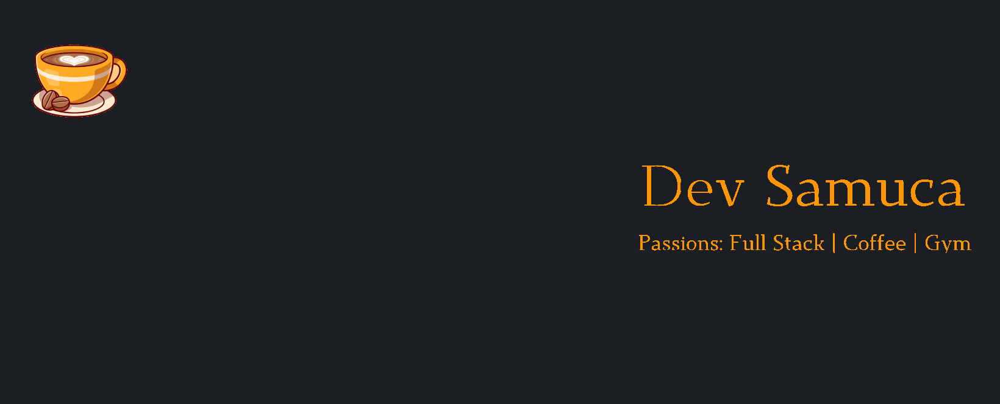

## 📖 About Me
- 🖥 Passionate about coding and learning
- ☕ Crazy lover for coffee and cooking
- 💼 Freelancer as a Fullstack developer
- 🎓 Studying System Development and Analysis at Universidade Catolica de Brasilia (UCB)

## 💻 Tecnologies
  

     
     
     
     
     
     
     
     
     
     
    
     
    
     
    
     
     
     
    
  

## ✈️ How to reach me:
- mail: samukama18@gmail.com
- linkedin: [/elkurud](https://linkedin.com/in/elkurud)
